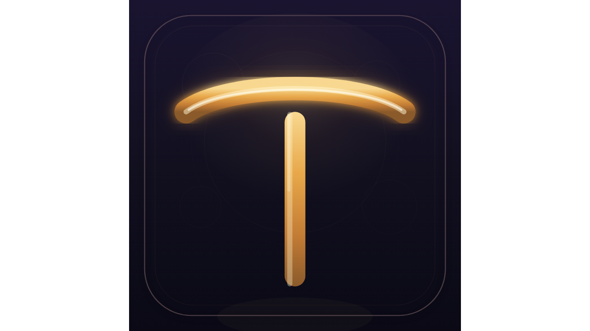
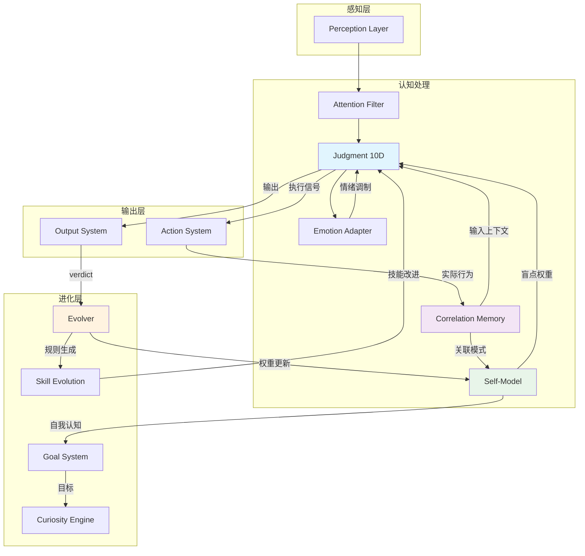

# ⚖️ guyong-juhuo · 判断系统

<p align="center">
  
</p>

**An evolving personal AI agent that mimics a specific individual, then surpasses human-level judgment.**

> 不是工具。是一个会随时间成长的数字分身。

---

## 这是什么

guyong-juhuo 是一个 **12子系统 AI Agent 框架**，基于 LLM 后端（MiniMax / OpenAI / Ollama）。它在 10 个认知维度上模拟特定个人的判断模式，通过闭环反馈不断进化，直到判断力超越人类整体。

核心区别：大多数 AI Agent 优化"什么是正确的"。guyong-juhuo 优化**"这个特定的人会怎么决定，为什么"**——然后闭环让系统越变越好。

---

## 12 个子系统

**图例：** ✅ 核心（闭环跑通，有验证数据） · 🟡 优化（逻辑完整，参数/边界条件待调） · ⚪ 待验证（代码完成，未实际运行）

| # | 状态 | 子系统 | 功能 |
|---|------|--------|------|
| 1 | ✅ | **Judgment** | 十维并行评估；biography 个性化注入 + intent router；metacognitive=9维标准差元监控 |
| 2 | ✅ | **Correlation Memory** | 快路径日志 + 慢路径因果推断；morning_routine follow-up 触发 outcome 闭环 |
| 6 | ✅ | **Emotion System** | PAD 三维模型；情绪是信号，调制10维信心度 |
| 7 | ✅ | **Self-Evolution** | receive_actual_choice → receive_verdict → 维度权重更新；predict_outcome + morning follow-up |
| 3 | 🟡 | **Curiosity Engine** | 双随机游走（80%目标驱动/20%自由探索），Ralph 循环终止 |
| 4 | 🟡 | **Goal System** | 洋葱分层：5年 → 年度 → 月度 → 周 → 今日；自我模型驱动目标更新 |
| 5 | 🟡 | **Self-Model** | 贝叶斯盲点追踪；积累"我容易在这里犯错"；关联记忆触发更新 |
| 8 | 🟡 | **Output System** | 决定什么时候说话、什么时候沉默；P0-P4 优先级格式化 |
| 9 | 🟡 | **Action System** | 四象限紧急度 × 重要性排序 + 执行信号生成 |
| 12 | 🟡 | **Feedback System** | 双循环：判断层 + 进化层，5层自我防御钩子 |
| 11 | ⚪ | **Skill Evolution** | 自动检测技能冲突 + 自主改进低性能技能；待实际运行验证 |
| 10 | ⚪ | **Perception Layer** | 注意力过滤器 + Web + PDF + RSS + 邮件适配器；适配器待接入真实数据 |

**三档说明：** ✅ 核心 = 闭环跑通，有验证数据 · 🟡 优化 = 逻辑完整，参数/边界条件待调 · ⚪ 待验证 = 代码完成，未实际运行

---

| 模式 | 说明 |
|------|------|
| **Mimic Mode** | 传入 `agent_profile` — 系统强制对齐该人的判断风格 |
| **Transcend Mode** | 10个通用维度；无 profile — 系统基于纯推理判断，闭环直到超越人类 |

**铁律：** _模仿具体个人，超越人类整体。_

---

## 第三层：模仿 → 超越 的转换机制

这是整个系统的核心闭环，也是之前缺失的一层。

```
┌─────────────────────────────────────────────────────────────┐
│                      模仿阶段（学你）                          │
│                                                             │
│  biography（你是谁）                                          │
│  experiences（你过去怎么做）    ──→  预测：遇到X会这么做        │
│  behavior patterns（行为风格）                                │
└────────────────────────────┬────────────────────────────────┘
                             │ 差值
                             ▼
┌─────────────────────────────────────────────────────────────┐
│                    反馈阶段（修正）                           │
│                                                             │
│  实际：遇到X，你实际做了Y          ──→  error = 预测 vs 实际    │
│  差值驱动权重更新                ──→  修正对这个人的判断模型    │
│  下次判断更准                                             │
└────────────────────────────┬────────────────────────────────┘
                             │ 积累足够多差值
                             ▼
┌─────────────────────────────────────────────────────────────┐
│                    超越阶段（比你更懂你）                      │
│                                                             │
│  在这个人的判断维度上，预测精度超过他自己  ──→  比他更知道      │
│  什么是对的                                           │
└─────────────────────────────────────────────────────────────┘
```

**关键点：** 超越不是凭空发生的。是在"预测→实际→差值→修正"的循环中，积累出对这个人的判断优势。当系统对这个人的预测比他自己还准时，就是超越的时刻。

这条链路，也是 Self-Evolver 的输入来源——每次 verdict 后的实际结果，都在喂养进化引擎。

---

## 最小可行出口

当前优先级：**早晨决策场景** — 每天早上问一次"今天最适合做什么"。

这个场景完整串通以下闭环：

```
输入（精力/情绪/待办）
  → Judgment 10维判断
  → 推荐今日行动
  → 实际执行
  → verdict反馈（判断对了还是错了）
  → Correlation Memory 记录
  → Evolver 更新权重
  → 明天判断更准
```

先把这个场景完全跑通，再扩展到其他场景。不是一次性建完所有子系统，而是用这个闭环来验证架构。

---

## 快速开始

```bash
git clone https://github.com/taxatombt/guyong-juhuo.git
cd guyong-juhuo
pip install -r requirements.txt

# 配置 API key（复制 .env.example 为 .env 并填入 MINIMAX_API_KEY）
# MiniMax API key 在 https://platform.minimaxi.com 获取

# CLI 判断
python -m juhuo "要不要辞职创业？"

# 早晨决策闭环（精力/情绪/待办 → 10维判断 → verdict 反馈）
python morning_routine.py

# Web Console
python -m juhuo web

# 查看状态
python -m juhuo status
```

---

## 判断输出示例

```
=== 判断: "要不要辞职创业？" ===

  cognitive       ████████████████░░  82%  "需要更多薪资数据"
  game_theory     █████████████░░░░░  75%  "反要约风险"
  economic        ████████████████░░  85%  "35%薪资差距值得考虑"
  dialectical     ███████████████░░░  78%  "双方都有道理"
  emotional       ████████████░░░░░░  65%  "对后悔的焦虑"
  intuitive      ███████████████░░░  80%  "外面有更好的机会"
  moral           ████████████░░░░░░  70%  "对家庭的责任"
  social          ██████████░░░░░░░░  60%  "网络机会成本"
  temporal        ██████████████░░░  72%  "3个月窗口最优"
  metacognitive   ███████████████░░░  79%  "当前分析过于自信"

  → 建议: 谨慎考虑（置信度: 高, 81%）
  → chain_id: j_1776149590792
```

---

## 早晨决策闭环

```bash
python morning_routine.py
```

完整串通：
```
精力/情绪/待办
  → 10维判断（biography个性化 + 情绪调制）
  → 推荐今日行动
  → predict_outcome() 记录预测
  → 实际执行
  → 早晨 follow-up（询问昨天执行结果）
  → receive_actual_choice → receive_verdict
  → Correlation Memory 慢路径因果推断
  → Evolver 更新维度权重
  → 明天判断更准
```

---

## 架构



**数据流说明：**

| 调用链 | 触发条件 | 数据内容 |
|--------|----------|----------|
| Perception → Judgment | 每条输入 | 原始消息 / 上下文 |
| Judgment → Emotion | 每轮判断 | 情绪状态 |
| Emotion → Judgment | 每轮判断 | 情绪调制后的维度权重 |
| Correlation Memory → Judgment | 判断前 | 相关事件上下文（时序相关，非因果） |
| Self-Model → Judgment | 判断前 | 权重偏见（"我容易在这里犯错"） |
| Judgment → Output | 判断后 | verdict + confidence |
| Output → Evolver | 用户反馈后 | verdict + actual choice |
| Evolver → Self-Model | 验证通过 | 更新的维度权重 |
| Self-Model → Goal | 定期 | 自我认知更新目标 |
| Goal → Curiosity | 定期 | 目标驱动探索 |

闭环：判断 → 记录链 → 用户反馈 verdict → 信念更新 → 下次判断改善

---

## 技术栈

- **Python 3.11+** (核心逻辑)
- **MiniMax / OpenAI / Ollama** (LLM 后端)
- **Flask** (Web Console)
- **SQLite** (判断链 + 信念滚动缓冲)

---

## 下载安装包

👉 https://github.com/taxatombt/guyong-juhuo/releases/latest

下载 `guyong-juhuo-setup.exe`（约 100 MB），双击安装。

详细说明：[INSTALL_GUIDE.md](https://github.com/taxatombt/guyong-juhuo/blob/main/INSTALL_GUIDE.md)

---

## 安装（源码）

```bash
pip install -r requirements.txt
python -m juhuo web
# 访问 http://localhost:18768
```

---

## 配置

```
E:\juhuo\.env        — API keys（项目根目录，本地优先）
~/.juhuo/.env       — 用户目录（可覆盖，gitignore）
```

首次配置：
```bash
python -m juhuo config wizard  # 首次配置向导
```

---

## CLI 命令

```bash
# 核心
python -m juhuo "问题"              # 单次判断
python -m juhuo shell               # 交互模式
python -m juhuo web                 # Web Console（默认 port 18768）

# 判断反馈
python -m juhuo verdict list        # 判断历史
python -m juhuo verdict correct <id>   # 标记正确
python -m juhuo verdict wrong <id>     # 标记错误

# 画像 & 记忆
python -m juhuo bio show           # 查看用户画像
python -m juhuo bio add "我30岁程序员"  # 添加生平信息
python -m juhuo bio list           # 列出所有生平事实

# 行为 & 经验
python -m juhuo behavior stats      # 行为统计
python -m juhuo behavior list       # 最近行为记录
python -m juhuo behavior show <id>  # 行为详情
python -m juhuo experience list     # 经验列表
python -m juhuo experience rate <id> # 评分经验

# 早晨决策闭环（完整反馈回路）
python morning_routine.py

# 状态 & 工具
python -m juhuo status              # 状态查看
python -m juhuo benchmark            # GDPVal Benchmark 测试
python -m juhuo config show         # 显示配置
python -m juhuo config wizard        # 首次配置向导
```

---

## Life OS（精力/情绪驱动的任务调度）

独立脚本，不需要 MiniMax API key（rules mode）或可配合 juhuo（juhuo mode）：

```bash
# Rules mode（基于内置规则，无 API 调用）
python life_os.py 写报告 健身 见客户 --energy 80 --emotion P=0.5,A=0.6,D=0.7

# Juhuo mode（调用 MiniMax LLM 排序，需要 API key）
python life_os.py 写报告 健身 见客户 --energy 80 --emotion P=0.5,A=0.6,D=0.7 --juhuo

# 参数
#   --energy <0-100>  精力水平（默认 50）
#   --emotion P=X,A=X,D=X  PAD情绪坐标（P愉悦/A唤醒/D支配，-1到1）
#   --juhuo  启用 juhuo 模式
```

情绪关键字：
| 关键字 | PAD | 情绪 |
|--------|-----|------|
| `P=0.3,A=0.5,D=0.6` | 兴奋 | 高能量状态，适合深度工作 |
| `P=-0.4,A=0.3,D=-0.2` | 焦虑 | 低能量，谨慎决策 |
| `P=0.5,A=-0.2,D=0.3` | 愉悦 | 放松，适合创造性工作 |

---

## 设计原则

- **铁律保护核心身份** — 某些特质不能被进化掉
- **Fitness = "与你是谁一致"** — 不是"通用标准认为正确的"
- **完整版本快照** — 任何历史状态都可恢复
- **判断链滚动缓冲** — SQLite，100条上限
- **有限信念更新** — 每次 verdict 最多 10% 变化，饱和在 0.05 / 0.95

---

## TODO（下次版本）

> 方向收拢：因果记忆选型已完成，Self-Evolver 目标降级为「维度权重自动调整」。

- [x] **Verdict 数据积累** — 72条 verdict_outcomes（v2.2.1）
- [x] **维度权重闭环** — verdict → belief → prior_adj → LLM prompt 全通（v1.8）
- [x] **三途径信息层** — biography 生平 + experiences 经历 + behavior 行为日志（v2.0）
- [x] **Life OS v3** — 精力/情绪驱动任务调度，rules + juhuo 双模式（v2.0）
- [x] **UnifiedProfile 单汇聚层** — inject_unified_profile 唯一入口，pipeline 325→265行（v2.0）
- [x] **三路优先级铁律** — experiences > biography > behavior，per-item half_life_days（v2.0）
- [x] **P1 矛盾双向检测** — L1 降 priority=3，L2 升 priority=1，to_prompt 结构化（v2.0）
- [x] **experiences embedding v1** — MiniMax ebo-01 向量 + cosine similarity 混合检索（v2.0）
- [x] **JudgmentBudget 预算保护** — 栈深度+verdict数+超时三重保护，防止递归（v2.2.1）
- [x] **FTS5全文索引** — experiences bm25排序 + 3个同步触发器 + keyword fallback去重（v2.2.1）
- [ ] **生产数据积累** — benchmark 待 MiniMax API 稳定后继续（v2.1）
- [x] Self-Evolver rollback 修复 + 验证闭环（v1.6）
- [x] judgment/config.py 集中生产配置（v1.6）
- [x] GDPVal Benchmark 22案例 + A/B/C/D 评分（v1.6）
- [x] verdict_collector: import_from_judgment_db()（v1.6）
- [x] InsightTracker 完整实现（v1.5）
- [x] ContextFence 围栏（v1.5）
- [x] _legacy 清理（__trash__/）（v1.6）

---

## 版本更新

### v2.3 (2026-05-05) — 三个结构性修复 + LLM 真实调用

**LLM 真实调用（根因：API key 从未加载）：**
- `load_env_files()` 定义了但从未被调用 → `cli.py` 入口处调用
- `.env` 在 `E:\juhuo\.env`，loader 只读 `~/.juhuo/.env`（不存在）
- 修复：`env_loader.py` 加载路径加入 `PROJECT_ROOT/.env`
- 影响：之前所有判断都是低置信度 fallback，现在真正调用 MiniMax-M2

**biography 真正接入 10 维判断（结构性修复 #1）：**
- `llm_orchestrator.py`：`inject_profile_into_dimensions()` → 返回 `{weights, prompts}`
- 10 维各有专属追问模板：`temporal→"5年后回头看？"`、`emotional→"做后情绪状态？"` 等
- biography 特征词→权重推断：`长期主义`→`temporal×1.8`、`保守`→`game_theory×1.5`
- 高权重维度从 `important` 升级到 `must`（确保分析）

**慢路径因果推断（结构性修复 #2）：**
- `correlation_memory.py`：`batch_causal_inference()` 扫描已完成 judgment，统计 action→outcome 共现
- `>=2次共现+avg_score>0.6` → 建立 `CorrelationLink`
- 新增 `run_slow_path()`：cron 入口，批量推断+深度压缩+自模型通知

**verdict 真正改变行为（结构性修复 #3）：**
- `router.py` `check10d_run` 末尾：调用 `predict_outcome()` 标记 pending
- `morning_routine.py`：早晨询问昨天 pending judgments 的执行结果
- `receive_actual_choice` → `receive_verdict` → 维度权重更新 → 下次判断改善

**空链修复（4 条）：**
- Self-Model → Goal System：高置信度偏差(≥0.5) → 目标建议
- Goal System → Curiosity：新目标建议 → 探索实现路径
- Evolver → Skill Evolution：进化完成且 lessons_added>0 → 生成改进建议

**morning_routine.py（最小可用闭环）：**
- 精力/情绪/待办 → 10 维判断 → 推荐 → 实际执行 → verdict 反馈
- `_follow_up_pending_outcomes()`：早晨自动 follow-up

**causal_memory → correlation_memory（彻底重命名）：**
- 所有类/函数/变量名：`Causal*` → `Correlation*`（CausalRelation / CausalLink / CausalInferenceEngine 等）
- `__init__.py` 向后兼容别名：`CausalInferenceEngine` → `CorrelationInferenceEngine`
- 外部引用（router.py / hermes_integration / juhuo.py）全部更新

**metacognitive 改为 9 维标准差元监控（Review #3 采纳）：**
- `router.py` `check10d_run`：`_score_verdict_candidate` 提取 9 维各自评分 → `statistics.stdev()` 计算标准差
- `标准差>0.15` → metacognitive 告警"判断不稳定"；≤0.15 → "判断稳定"
- metacognitive 从第10独立维度改为前9维的元监控维度
- `llm_calls.py`：`NICE_TO_HAVE` 移除 `metacognitive`

**README 子系统三档标记（Review #6 采纳）：**
- ✅ 核心（4个）：Judgment / Correlation Memory / Emotion System / Self-Evolution
- 🟡 优化（8个）：Curiosity / Goal / Self-Model / Output / Action / Feedback / Skill Evolution
- ⚪ 待验证（1个）：Perception Layer

### v2.2.1 (2026-04-24) — Hermes Guide P0 落地

**JudgmentBudget 预算保护：**
- `judgment/judgment_budget.py`：`BudgetExceeded` 异常 + 线程局部计数器（depth/verdict_count/start_time）
- `subsystems/judgment/closed_loop.py`：`receive_verdict` 入口集成三重保护
- 来源：Hermes Guide 教训 — "预算是第一道防线，防止 90% 失控"

**FTS5 全文索引（experiences 重构）：**
- Part 1：`init()` 建 FTS5 虚拟表 + 3个同步触发器（AI/AD/AU）
- Part 2：`fts_search()` bm25 排序全文搜索
- Part 3：`find_similar()` FTS5-primary + keyword fallback 去重合并
- 来源：Hermes Guide 教训 — "SQLite FTS5 优于关键词 bigram"

**P2 Stop-Hook 无限递归修复：**
- 递归深度 73→2 层，`max_depth` 285→18
- 20 verdict 批量从 >120s → ~20s

### v2.1 (2026-04-22) — v2.0 根因修复 + Benchmark 验证

**P0 outcome_score 写入链路修复（根因链 2026-04-22）：**
- experiences 表 schema 缺少 `chain_id` 列 → 新增列 + migration
- `_trigger_fitness()` 从未调用 `experiences.record_outcome()` → 新增调用
- `chain_id` 哈希不匹配（experiences=SHA256[:16], judgment_snapshots=MD5[:24]）→ 改用 `task_text` 通过 `task_hash` 匹配

**Commit 链：**
```
f7025fe fix(P0): experiences.outcome_score写入链路修复
c315212 fix: record_outcome用task_text匹配，避免SHA256vsMD5哈希不匹配
```

**UnifiedProfile 验证（2026-04-22）：**
- Profile entries: 29条已注入（verified: check10d_run 返回 `_profile_entries` 正确填充）
- MiniMax: 429服务端过载，benchmark 待恢复

---

### v2.0 (2026-04-22) — UnifiedProfile 单汇聚层 + P1 Review 全部完成

**单汇聚点架构：**
- `inject_unified_profile()` 是唯一汇聚点（移除 `inject_biography`/`inject_experiences`/`inject_correlation_memory` 三个旧 injector）
- pipeline.py：325→265行死代码清理
- router 只读 `_profile_entries`（不再拼接 `bio_context`/`history_context`/`causal_context`）

**三路优先级铁律**：experiences(做的) > biography(说的) > behavior(被动追踪的)
- L2 experiences：`find_similar_structured()` — `similarity(0.6) + keyword_overlap(0.4)` 融合权重
- L1 biography：per-item `half_life_days` 分级半衰期（finance=90d / career=180d / personality=730d）
- L2 behavior：`_get_l3_behaviors()` → `BehaviorEntry` dataclass → 合并进 L3 intents

**P1 Review 全部完成：**
- 矛盾双向检测：`generate()` — L1 降 priority=3，L2 升 priority=1，`contradiction_flag` 双向
- `to_prompt()` 结构化：`[PROFILE: priority=X, source=Y, recency=Z, claim="...", flag=Z]`
- perception_intents 表路径修复：`_pi_db == _juhuo_db == E:\juhuo\data\juhuo.db`

**experiences embedding v1：**
- MiniMax `embo-01` 向量 + cosine similarity 混合检索
- `_cosine_sim()` 纯 Python 实现，零 numpy 依赖

---

### v2.0 (2026-04-21) — 三途径信息层 + Life OS v3

**三途径信息层：**
- `judgment/biography.py`: 生平事实层，26条正则，8类（年龄/职业/家庭/财务/所在地/健康/价值观/学历）
- `judgment/exiences.py`: 经历层，20条冷启动种子，sliding window 中文 bigram 关键词匹配
- `judgment/behavior_logger.py`: 行为日志层，8个 ActionChannel，工具调用链脱敏

**Life OS v3：**
- `life_os.py` 完全重建：`_juhuo_rank()` 直接调用 MiniMax adapter（单 prompt，不走 10 维 pipeline）
- verdict 解析：从 `排序:[1,2,...]` 提取排名，映射到置信度（第1名=100%，第2名=85%...）
- API 超载 fallback：返回 60% 均分

**关键修复：**
- MiniMax `<think>` 块太长导致正文为空 → 手动 `re.sub(r"<think>.*?</think>","",...)`
- `judgment/router.py` 删除影子 `_answer_questions`（委托 `llm_calls.py`）

---

### v1.8 (2026-04-21) — Self-Evolver 闭环全通 + P0 死锁修复

**核心修复：**
- **RLock 死锁**：`judgment_db.py` `Lock()` → `RLock()` — 解决 `receive_verdict` → `verify_evolution` 嵌套调用永久阻塞（120s → 0.3s）
- **INSTR SQL**：`closed_loop.py` `LIKE '%"dims":[%'` → `INSTR(dimensions,'\"dims\"')>0` — SQLite LIKE 双引号转义失效修复

**闭环打通（v1.7 遗留 P0）：**
- `apply_evolved_weights()` 末尾同步写 `dimension_beliefs` 表（进化后权重真正影响判断）
- `_rollback()` 从 `evolved_weights.json.history[-2]` 恢复（路径修复 + 数据源修正）
- `prior_adj` 注入 LLM prompt（强维度≥0.7→"更自信深入"，弱维度≤0.45→"更谨慎"）
- `_ensure_started()` 懒启动（消除 import 副作用，测试可正常 mock）

**数据状态：**
- verdict_outcomes: 49条（接近50目标）
- causal_chain: 100条（滚动缓冲区上限）

### v1.7 (2026-04-18) — 三层架构重构 Phase 1

### v1.6 (2026-04-17) — Self-Evolver 验证闭环完成

- **配置**：judgment/config.py — 集中生产参数（BIAS=3, MIN=5, COOLDOWN=24h）
- **Evolver**：apply_evolved_weights() 现已调用 start_evolution_tracking() — 完整验证闭环
- **Router**：EvolverScheduler 在初始化时自动启动（后台每1小时检查）
- **Benchmark**：22案例（原8），语义同义词匹配，维度覆盖率，GDPVal A/B/C/D 评分
- **verdict_collector**：import_from_judgment_db() 从 juhuo 自有 snapshots 种子导入；run_full_collection() CLI
- **HRR 监控**：评估报告（difflib够用），升级触发条件已文档化，**暂不自研**

### v1.5.2 (2026-04-17)

新增：
- **Claude Code 启发**：Verification Agent + Tool Governance (14步) + 四道压缩
- **OpenClaw 启发**：Skills 按需加载 + Hook 系统 (17事件) + Session 管理
- **QwenPaw 启发**：LLM 限流 (QPM/并发) + Retry + Backoff + EnvVarLoader
- **Web Console**：Flask 界面 + REST API
- **Benchmark**：8案例测试集，维度准确率评估
- **Self-Test**：6项启动自检
- **MCP Server**：judgment_10d / judgment_verdict / judgment_status
- **i18n**：多语言支持 (zh_CN / en_US)
- **Docker**：Dockerfile + docker-compose.yml

### v1.5.0 (2026-04-14)

初始版本，10维判断框架 + 因果记忆 + 自我模型

---

<p align="center">
  <a href="https://github.com/taxatombt/guyong-juhuo">GitHub</a> ·
  <a href="https://github.com/taxatombt/guyong-juhuo/releases">Releases</a>
</p>
