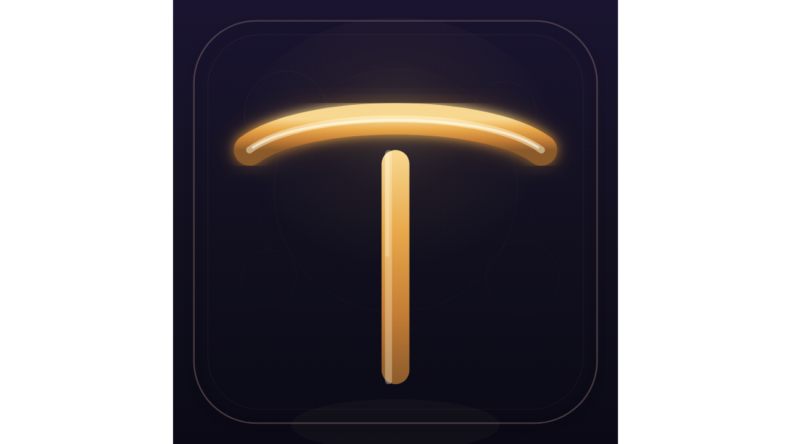

# guyong-juhuo · Judgement System

<p align="center">
  
</p>

**An evolving personal AI agent that mimics a specific individual, then surpasses human-level judgment.**

> Not a tool. A digital alter-ego that grows over time.

---

## What It Is

guyong-juhuo is a **12-subsystem AI agent framework** built on top of LLM backends (MiniMax / OpenAI / Ollama). It simulates the judgment patterns of a specific individual across 10 cognitive dimensions, then improves itself through a closed feedback loop until its judgment exceeds human-level overall.

The core distinction: most AI agents optimize for "what is correct." guyong-juhuo optimizes for **"what would this specific person decide, and why"** — then closes the loop so the system gets better over time.

---

## The 12 Subsystems

| # | Subsystem | What It Does |
|---|-----------|--------------|
| 1 | **Judgment** | 10-dimension parallel evaluation (cognitive · game-theory · economic · dialectical · emotional · intuitive · moral · social · temporal · metacognitive) |
| 2 | **Causal Memory** | Fast/slow dual-stream: instant logging + batch causal inference across events |
| 3 | **Curiosity Engine** | Dual random walk (80% goal-driven / 20% free exploration), Ralph loop termination |
| 4 | **Goal System** | Onion-layered: 5-year → annual → monthly → weekly → today |
| 5 | **Self-Model** | Bayesian blind-spot tracking; accumulates "I tend to err here" patterns |
| 6 | **Emotion System** | PAD 3D model (Pleasure × Arousal × Dominance); emotions as signal, not noise |
| 7 | **Self-Evolution** | Closed-loop: every error → analyzed → rule written → next instance prevented |
| 8 | **Output System** | Decides when to speak and when to stay silent; P0–P4 priority formatter |
| 9 | **Action System** | Four-quadrant urgency × importance sorting + execution signal generation |
| 10 | **Perception Layer** | Attention filter + web adapter + PDF adapter + RSS + email adapters |
| 11 | **Skill Evolution** | Auto-detects skill collision + autonomously improves underperforming skills |
| 12 | **Feedback System** | Dual-loop: judgment layer + evolution layer, 5-layer self-defense hooks |

---

## Two Modes

| Mode | Description |
|------|-------------|
| **Mimic Mode** | Pass in `agent_profile` — the system forces alignment to that individual's judgment style |
| **Transcend Mode** | 10 generic dimensions; no profile — system judges on pure reasoning and closes the loop until it outperforms humans |

**The iron law:** _Mimic a specific individual. Transcend humanity as a whole._

---

## Quick Start

```bash
git clone https://github.com/taxatombt/guyong-juhuo.git
cd guyong-juhuo
pip install -r requirements.txt

# Judge from CLI
python cli.py "Should I quit my job to start a business?"

# Web Console
python cli.py web

# Check status
python cli.py status

# Self-test
python cli.py test
```

---

## Judgment Output Example

```
=== Judgement: "Should I quit my job to start a business?" ===

  cognitive       ████████████████░░  82%  "Need more salary data"
  game_theory     █████████████░░░░░  75%  "Counter-offer risk"
  economic        ████████████████░░  85%  "35% salary gap justifies search"
  dialectical     ███████████████░░░  78%  "Both sides have merit"
  emotional       ████████████░░░░░░  65%  "Anxiety about regret"
  intuitive      ███████████████░░░  80%  "Something better out there"
  moral           ████████████░░░░░░  70%  "Obligation to family"
  social          ██████████░░░░░░░░  60%  "Network opportunity cost"
  temporal        ██████████████░░░  72%  "3-month window optimal"
  metacognitive   ███████████████░░░  79%  "Overconfident in current analysis"

  → RECOMMEND: Consider carefully (confidence: HIGH, 81%)
  → chain_id: j_1776149590792
```

---

## Architecture

```
Perception  →  Attention Filter  →  Judgment (10D)
                                           ↓
                                    Causal Memory
                                           ↓
                                     Self-Model
                                           ↓
                                   Closed Feedback Loop
                                    ↕ (verdict signals)
                                   Evolver
                                           ↓
                                   Skill Evolution
```

The closed loop: judgment is made → chain is recorded → user sends post-hoc verdict → beliefs update → next judgment reflects learned adjustment.

---

## Tech Stack

- **Python 3.11+** (core logic)
- **MiniMax / OpenAI / Ollama** (LLM backends)
- **Flask** (web console)
- **SQLite** (judgment chain + belief rolling buffer)

---

## Installation

```bash
pip install -r requirements.txt
python cli.py web
# Open http://localhost:18768
```

---

## Configuration

```
~/.juhuo/.env       — API keys (highest priority, never committed to git)
```

First-time setup:
```bash
python cli.py config init  # Create template
python cli.py config edit  # Edit config
```

---

## CLI Reference

```bash
python cli.py "question"       # Single judgment
python cli.py shell           # Interactive mode
python cli.py web             # Web Console
python cli.py status          # Status view
python cli.py verdict list    # History
python cli.py verdict correct <id>   # Mark correct
python cli.py verdict wrong <id>     # Mark wrong
python cli.py config show      # Show config
python cli.py config init      # Init config
python cli.py test             # Self-test
python cli.py benchmark         # Benchmark
```

---

## Design Principles

- **Iron law protects core identity** — certain traits cannot be evolved away from
- **Fitness = "consistent with who you are"** — not "what general-purpose standards deem correct"
- **Full version snapshots** — any past state of the system is recoverable
- **Judgment chain rolling buffer** — SQLite, 100 entries max, bounded file size
- **Bounded belief updates** — max 10% change per verdict, saturation at 0.05 / 0.95

---

## TODO (Next Version)

> The biggest gap right now is not new features — it's making Self-Evolver go from "runs" to "verified".

- [ ] **Verdict data accumulation** — Target 50+ cases, multi-scenario coverage *(in progress: 22 benchmark + judgment_db seeds)*
- [ ] **Self-Evolver verification loop** — verify_evolution() + auto-verify + rollback *(v1.6: closed)*
- [ ] **Production config** — BIAS=3, MIN_SAMPLES=5, COOLDOWN=24h *(v1.6: judgment/config.py)*
- [ ] **GDPVal Benchmark** — Evaluate judgment quality with standard case set *(v1.6: 22 cases, A/B/C/D grade)*
- [ ] **HRR vector retrieval** — Evaluate if causal memory needs vector search upgrade *(v1.6: report done, trigger at 500 events)*
- [x] Verdict auto-accumulation (v1.5)
- [x] evolution_validator tracking (v1.5)
- [x] InsightTracker full implementation + router.py + closed_loop.py (v1.5)
- [x] ContextFence wrapping for inject_to_judgment_input (v1.5)
- [x] _legacy cleanup (archived to __trash__/)
- [x] Self-Evolver verification loop closed (apply_evolved→start_evolution_tracking) (v1.6)
- [x] EvolverScheduler background init (router.py) (v1.6)
- [x] judgment/config.py centralized production config (v1.6)
- [x] GDPVal Benchmark 22 cases + semantic matching + A/B/C/D grade (v1.6)
- [x] verdict_collector: import_from_judgment_db() + run_full_collection() (v1.6)
- [x] HRR vector evaluation report + upgrade trigger conditions (v1.6)

---

## Changelog

### v1.6 (2026-04-17) — Self-Evolver Verification Loop Closed

- **Config**: judgment/config.py — centralized production parameters (BIAS=3, MIN=5, COOLDOWN=24h)
- **Evolver**: apply_evolved_weights() now calls start_evolution_tracking() — full verification loop
- **Router**: EvolverScheduler now auto-starts on init (background 1h interval)
- **Benchmark**: 22 cases (was 8), semantic synonym matching, dimension_coverage, GDPVal A/B/C/D grade
- **verdict_collector**: import_from_judgment_db() seeds from juhuo's own snapshots; run_full_collection() CLI
- **HRR**: Evaluation report with vector search upgrade trigger conditions (500 events / 100ms)

### v1.5.2 (2026-04-17)

Added:
- **Claude Code inspired**: Verification Agent + Tool Governance (14-step) + Four-way Compaction
- **OpenClaw inspired**: Skills on-demand loading + Hook system (17 events) + Session management
- **QwenPaw inspired**: LLM rate limiting (QPM/concurrent) + Retry + Backoff + EnvVarLoader
- **Web Console**: Flask UI + REST API
- **Benchmark**: 8-case test suite, dimension accuracy evaluation
- **Self-Test**: 6-item startup check
- **MCP Server**: judgment_10d / judgment_verdict / judgment_status
- **i18n**: Multi-language (zh_CN / en_US)
- **Docker**: Dockerfile + docker-compose.yml

### v1.5.0 (2026-04-14)

Initial release, 10-dimension judgment framework + causal memory + self-model

---

<p align="center">
  <a href="https://github.com/taxatombt/guyong-juhuo">GitHub</a> ·
  <a href="https://github.com/taxatombt/guyong-juhuo/releases">Releases</a>
</p>
